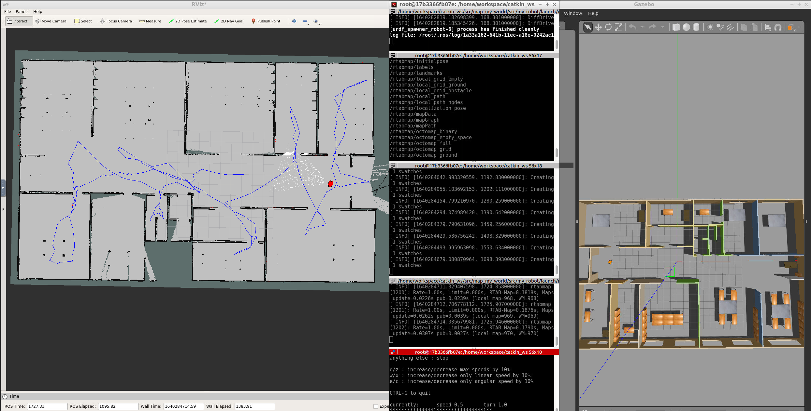
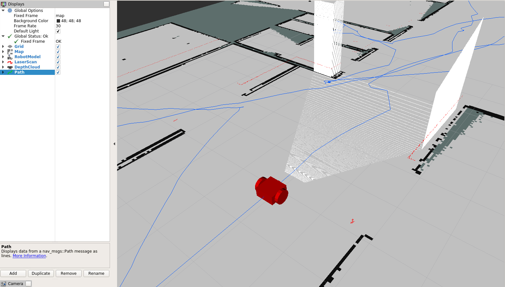

# map_my_world

Udacity's SW Engineer Course - Forth Project: Map My World!
The project is about Simultaneous Localization and Mapping (SLAM) using [RTAB-Map](http://wiki.ros.org/rtabmap_ros) package. It consist of two packages: `my_robot` (creating the robot, world and launching rtabmap package) and `teleop_twist_keyboard` (for controlling the robot using keyboard).

To change the parameters of the RTAB-Map package check the launch file in this directory: `src/my_robot/launch/mapping.launch`.



The structure of the project is shown below:

### Project Structure

    .map_my_world
    |
    ├── my_robot                       # my_robot package
    │   ├── config
    │   │   ├── mapping_rviz.rviz
    │   ├── launch
    │   │   ├── mapping.launch
    │   │   ├── localization.launch
    │   │   ├── robot_description.launch
    │   │   ├── world.launch
    │   ├── meshes
    │   │   ├── hokuyo.dae
    │   ├── urdf
    │   │   ├── my_robot.gazebo
    │   │   ├── my_robot.xacro
    │   ├── world
    │   │   ├── myWorld.world
    │   ├── CMakeLists.txt
    │   ├── package.xml
    |   |
    ├── teleop_twist_keyboard           # teleop_twist_keyboard package
    │   ├── teleop_twist_keyboard.py
    │   ├── CMakeLists.txt
    │   ├── package.xml
    └──

### World

The world is consist of mainly the office floor which the plan is taken from [roomsketcher.com](https://www.roomsketcher.com/floor-plan-gallery/325/office-floor-plan-examples/contemporary-office-floor-plan/) (as shown below):


### Robot

The robot consist of differential drive (to drive the two wheels), a lidar (hokuyo lidar), and the kinect-camera (RGB-D) which are added using Gazebo plugins.

|               3D Model                |         RVis Visualization          |
| :-----------------------------------: | :---------------------------------: |
|  |  |

## Getting Started

### Pre-requisites

To compile map creator we need to install the following libraries:

```
sudo apt-get install libignition-math2-dev protobuf-compiler
```

- Clone this repo to your local drive:
  `git clone https://github.com/Jeyhooon/map_my_world.git`
- Go to the `src` folder: e.g.: `cd ~/git/map_my_world/src`
- Clone the `teleop_keyboard` package: `git clone https://github.com/ros-teleop/teleop_twist_keyboard.git`
- Change directory to the root: e.g.: `cd ~/git/map_my_world`
- `catkin_make`
- `source devel/setup.bash`
- Run `roslaunch my_robot world.launch` (this only lunches the world and the robot)
- Open and source new terminal then run `roslaunch my_robot mapping.launch` (this launches the rtab-mapping algorithm)
- Open and source new terminal then run `roslaunch teleop_twist_keyboard teleop_twist_keyboard.py` (this would allow you to control the robot using keyboard)
